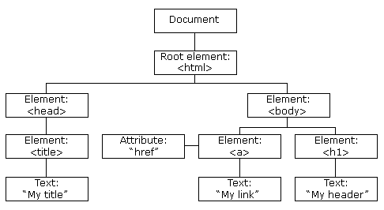

# Diseño y Aplicaciones en la web 2022


## Trabajo de investigación Temas:

 


   

## Grupo 3

- Cristaldo Yonathan Ariel 
- Wagner Nahuel


## Tema a investigar
    El tema propuesto para el trabajo de invesigación fue algún frameworck de javascript, el tema que vamos a investigar es Angular


### Que es angular?
    Es un marco de diseño de aplicaciones y una plataforma de desarrollo para crear aplciaciones eficientes y sofistificadas de una sola pagina.

    Es una plataforma de desarrollo, como plataforma incluye:

    - Un marco basado en componentes para crear aplicaciones webs escalabes.
    - Coleccion de bibliotecas integradas que cubren una amplia variedad de funciones, como ser enrrutamiento, gestion de formularios, comunicación cliente-servidor.
    - Herramientas de desarrollo para ayudar al desarrollo, compilación, pruebas y actualziaciones de código. 


### Componentes
Los componentes son los bloques de construcción que componen una aplicación, en un componente se incluye una clase de TypeScript '@Component()' con un decorador, plantilla HTML y estilos.


```html
import { Component } from '@angular/core';

    @Component({
    selector: 'hello-world',
    template: `
        <h2>Hello World</h2>
        <p>This is my first component!</p>
    `
    })
    export class HelloWorldComponent {
    // The code in this class drives the component's behavior.
    }
```

Para usar este componente, escribe lo siguiente en una plantilla:
```html
    <hello-world></hello-world>
```

Cuando Angular representa este componente, el DOM resultante se ve así:

```html
    <hello-world>
        <h2>Hello World</h2>
        <p>This is my first component!</p>
    </hello-world>
```
El modelo de componentes de Angular ofrece una fuerte encapsulación y una estructura de aplicación intuitiva. Los componentes también hacen que su aplicación sea fácil de probar y pueden mejorar la legibilidad general de su código.


### Plantillas

Cada componente tiene una plantilla HTML que declara como se represeta ese componente, la plantilla se define cen la linea o por ruta de archivo.
Angular actualiza automáticamente el DOM renderizado cuando cambia el estado de su componente.

```html
   <p>{{ message }}</p>
```
El valor de mensaje proviene de la clase de componente.

```html
   import { Component } from '@angular/core';

    @Component ({
        selector: 'hello-world-interpolation',
        templateUrl: './hello-world-interpolation.component.html'
    })
    export class HelloWorldInterpolationComponent {
        message = 'Hello, World!';
    }
```
Cuando la aplciacion carga el componente y la plantilla se vera lo siguiente:

```html
   <p>Hello, World!</p>
```


## Historia

Angular se ha convertido en el framework mas popular para crear aplicaciones de una sola pagína(Single Page Aplciations) 

Angular es mantenido en gran parte por google, asi como por desarrolladores a lo largo del mundo que reportan y ayudan a la mejora del frameworck.

Angular forma parte del Stack *MEAN* el cual es una integración de:
- MongoDB: Como gestor de Bases de Datos.
- ExpressJS: Como aplication web server.
- AngularJS: Encargado del Front-Ende de la aplciación.
- NodeJS: Encargado del Back-End de la aplciación.
  
Los 4 manejasn JavaScript como lenguaje de desarrollo.

## Caracteristicas
- **Document Object Model(DOM)**

Trata de un objeto XML o HTML como una estructura de árbol en la que cada nodo representa una parte del docuemento.


 

Angular usa DOM regular, se relaizan 10 actualizaciones en la misma pagna html. En lugar de actualizar las que ya se actualizaron, angular actualzara toda la estructura de árbol de las etiquetas html.

- **TypeScript**

Define un conjunto de tipos de JavaScript, lo que aydua a los usuarios a escribir código JavaScript que es mas facil de entender, todo el codigo de typeScript se compila en javascript y se puede ejecutar sin problemas en cualquier plataforma, no es obligatorio para desarrollar una aplicacion en angular.

- **Data Binding(Enlace de Datos)**

Es un proceso que permite a los usuarios manipular elementos de la pagina web a traves de un navegador web. Emplea HTML dinámico y no requiere secuencias de comandos ni programación complejas.

Angular usa el enlace bidireccional. EL estado del modelo refleja los cambios realziados en los elementos de la interfaz de usuario correspondientes.

- **Testing (Pruebas)**

Angular usa el Framework de prueba Jasmine. Jasmine proporciona múltiples funcionalidades para escribir diferentes tipos de casos de prueba. Karma es el ejecutor de tareas para las pruebas que usa un archivo de configuración para configurar la puesta en marcha, los reportes y el framework de prueba.

 

Angular es un marco modelo-vista-controlador (MVC) completo. 

- **Módulos**

Una aplicación Angular tiene un módulo raíz, llamado AppModule, que proporciona el mecanismo de arranque para iniciar la aplicación.

- **Metadatos**
- 
Los metadatos le dicen a Angular cómo procesar una clase. Se utiliza para decorar la clase para que pueda configurar el comportamiento esperado de una clase.


**Directivas Angular**

Las directivas amplían el HTML proporcionándole una nueva sintaxis. 

- La Directiva modelo ng
  
El modelo ng vincula el valor del control HTML con el valor de expresión

 

- La Directiva ng-bind
  
Esta directiva reemplaza el valor de control HTML con un valor de expresión

 

---
# **Ventajas**

## **Componentes personalizados** 

Los usuarios tienen total libertad de construir sus propios componentes que pueden empaquetar la funcionalidad junto con la lógica de renderizado en piezas reutilizables en el código.

## **Enlace de datos**

Una de las grandes ventajas es que permite a los usuarios mover datos sin esfuerzo desde el código JavaScript a la vista y reaccionar a los eventos del usuario sin tener que escribir ningún código manualmente.

## **Integral**

Angular es un framework completo y proporciona soluciones listas para usar para la comunicación del servidor, el enrutamiento dentro de su aplicación y más.

## **Compatibilidad del navegador**

Angular es multiplataforma y compatible con muchos navegadores. Una aplicación angular normalmente se puede ejecutar en todos los navegadores (por ejemplo; Chrome, Firefox) y sistemas operativos, como Windows, macOS y Linux.

## **Desventajas**

**Curva de aprendizaje empinada**

Los componentes básicos de Angular que todos los usuarios deben conocer incluyen directivas, módulos, decoradores, componentes, servicios, inyección de dependencias, pipes y plantillas. 

**Migración**

Una de las razones por las que las empresas no utilizan Angular con frecuencia es la dificultad de trasladar el código heredado basado en js / jquery a una arquitectura de estilo angular.

**Complejo**

Un problema común en la comunidad Angular es la forma en como debe escribirse el Framework. También es bastante complejo en comparación con otras herramientas de front-end.

## **Comparación entre los otros frameworks**

 


### **Angular vs React**

- **1 Universalidad:**

  - **React** es una libreria que se usa en el desarrollo web como en el móvil, para el desarrollo movil debe de incorporarse Cordoba, para eld esarrollo movil tambien exite la libreria React Native. Se puede usar para crear aplicaciones de una sola pagina o multiples paginas.
   
  - **Angular:** es adecuado para el desarrollo web y móvil, para el desarrollo movil tiene un framework de desarrollo adicional. La contraparte de React Native es NativeScript. Se puede usar para crear aplciaciones de una sola pagina o varias paginas
  
- **2 Autosuficiencia**
  - **React**  React es una librería para el desarrollo UI, por lo que las aplicaciones escritas con React para que puedas ser utilizadas necesitan librerías adicionales.
  - **Angular:** es un framework completo para el desarrollo de software, el cual generalmente no requiere de librerías adicionales.

- **3 Curva de aprendizaje**
  -  **React:** es minimalista: sin inyección de dependencias, sin plantillas clásicas, sin funciones demasiado complicadas. La librería será bastante sencilla de entender si ya conoces bien JavaScript.
  -  **Angular:**  en sí es una librería enorme, y aprender todos los conceptos asociados llevará mucho más tiempo que en el caso de React. 

- **4 Desempeño**
  -  **React** El rendimiento de React ha mejorado enormemente con la introducción del DOM virtual. Dado que todos los árboles DOM virtuales son ligeros y están integrados en el servidor, se reduce la carga en el navegador
  -  **Angular** El rendimiento de las aplicaciones de Angular se ve afectado negativamente por el enlace de datos bidireccional. A cada enlace se le asigna un observador para realizar el seguimiento de los cambios, y cada ciclo continúa hasta que se verifiquen todos los observadores y los valores asociados.

- **5 Directivas**
   -  **React**  En React, las plantillas y la lógica se explican en un solo lugar: al final del componente. Permite al lector captar rápidamente el significado del código incluso si no conoce la sintaxis.
   - **Angular:** cada plantilla se devuelve con un atributo: una directiva de cómo se debe configurar el objeto. La sintaxis de las directivas Angular es compleja y sofisticada, lo que la hace incomprensible para un lector sin experiencia trabajando con esta tecnología.
  
- **6 Componentes de la interfaz de usuario** 
    -  **React**  Las herramientas de interfaz de usuario para React son desarrolladas por la comunidad.
    -  **Angular:** Angular tiene un Material design preconstruidos. Hay varios botones, diseños, indicadores, ventanas emergentes y controles de formulario. Debido a esto, la configuración de la interfaz de usuario (UI) se vuelve más simple y rápida. 
  
- **7 Herramientas**
    - **React** React es compatible con varios editores de código. Por ejemplo, el código en React se puede editar con Sublime Text, Visual Studio y Atom. Para iniciar un proyecto, puede usar la herramienta Create React App (CLI). A su vez, la renderizacion del lado del servidor se completa con el uso del framework Next.js.
    - **Angular:**De manera similar a React, Angular es compatible con una variedad de herramientas de edición de código. Por ejemplo, puedes trabajar con editores de código como Aptana, Sublime Text y Visual Studio. Un proyecto se puede configurar rápidamente con Angular CLI. La renderizacion del lado del servidor se completa con la ayuda de Angular Universal.
  


## **Proyección a futuro**

La proyección a futuro que podemos hacer es que angular una frameworck de desarrollo web que seguira evolucionando con el pasar del tiempo ya que cuenta con el apoyo de la imensa comunidad que tiene detras..


## **Conclusion**

En términos generales podemos decir que es un tipo de framework muy útil a la hora de realizar aplicaciones web de una sola página, ya que se especializa en eso.
También desde nuestro punto de vista lo encontramos muy cómodo ya que nos permite separar el front-end y back-end.


    

## **Bibliografia**
[Que es Angular](https://www.hiberus.com/crecemos-contigo/que-es-angular-y-para-que-sirve/)

[Angular](https://angular.io/guide/what-is-angular)


[Comparación](https://www.freecodecamp.org/espanol/news/angular-vs-react-cual-elegir-para-su-aplicacion/#:~:text=Angular%20es%20un%20framework%20de%20desarrollo%20web%20y%20m%C3%B3vil%20completo,en%20un%20proyecto%20con%20React)